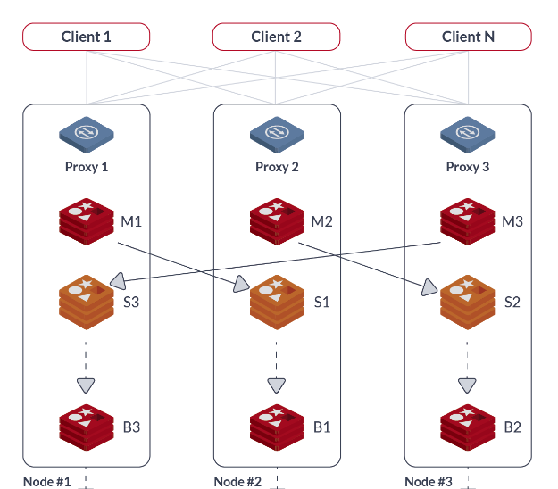

## About Redis

Redis thường được gọi là máy chủ cấu trúc dữ liệu, có thể được sử dụng như một database, cache hoặc message broker. Nó lưu trữ dữ liệu kiểu key-value. Redis hỗ rất nhiều kiểu cấu trúc dữ liệu như Strings, Lists, Sets, Sorted Sets, Hashes, HyperLogLogs, Bitmaps

Cấu trúc dữ liệu được đưa vào Redis có một số thuộc tính đặc biệt sau:

- Redis quan tâm đến phần lưu trữ dữ liệu trên disk, ngay cả khi chúng đang thực hiện việc xử lý trong memory. Nghĩa là Redis có thể vừa xử lý nhanh thông qua memory, và cũng an toàn hơn khi data đã lưu ở trên disk.

- Redis sử dụng ít memory hơn khi so sánh với các language khác có cùng mô hình cấu trúc dữ liệu

- Redis cung cấp đầy đủ các tính năng như replication, cluster, high available

## About Redis Cluster

Redis cluster cung cấp cách thức cài đặt redis mà dữ liệu tự động sharding qua nhiều node redis.

Redis cluster cung cấp vài cấp độ phân vùng dữ liệu mà cho phép tiếp tục thao tác dữ liệu khi một vài redis nodes lỗi hoặc không có sẵn (Tất nhiên vì một số node redis lỗi hoặc không thể giao tiếp được nên thao tác lấy dữ liệu từ ứng dụng đến redis sẽ chậm). Tuy nhiên cluster dừng thao tác khi có số lượng lỗi lớn như nhiều master node lỗi chẳng hạn.

**Redis Cluster TCP Ports**

Mỗi instance trong redis cluster yêu cầu 2 kết nối TCP open. Một port TCP được sử dụng để  phục vụ client kết nối và port còn lại đạt được bằng cách cộng thêm 1000 (ví dụ port giao tiếp client là 30001 thì port còn lại là 40001) là port dữ liệu. 

Read more>

[https://redis.io/topics/cluster-spec](https://redis.io/topics/cluster-spec)

[https://redis.io/topics/cluster-tutorial](https://redis.io/topics/cluster-tutorial)
